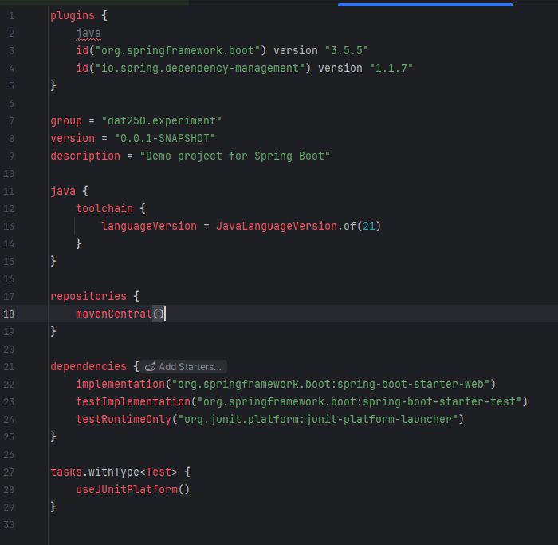
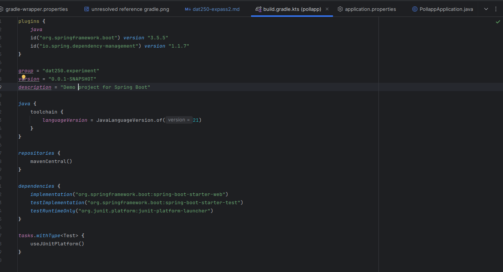

# DAT250: Software Technology Experiment Assignment 2

## Installation
- I used [Spring initializr](https://start.spring.io/) to start the project.
- Dependencies: ``Spring Web``

## Project set up
- After setting up the project, I noticed that a lot of _Zone.Identifier files were created.
- I found out that Windows adds Alternate Data Streams (ADS), such as _Zone.Identifier, whenever you download a file from the internet. These streams store metadata for security purposes.
- I tried to remove them permanently but didn’t succeed. Since they don’t affect the project, I simply added them to .gitignore and moved on. 
- Other than that, I was happy with how the project setup went.
- I knew for a fact that gradle worked, but the editor IntelliJ struggled to recognize `build.gradle.kts`. 
- Image below is after the project is indexed. Any suggestions? 

## Fix Unresolved reference
- I ended up installing IntelliJ through WSL. 
- Remove also _Zone.Identifier when swithing over IntelliJ within the Ubuntu enviroment. 

  
## Assignment
The assignment went fine without any  hard struggles.
- Everything worked smoothly.
- To run the test, I used the following command:
- ``gradle test --tests "dat250.experiment.pollapp.PollappApplicationTests.testScenario"``