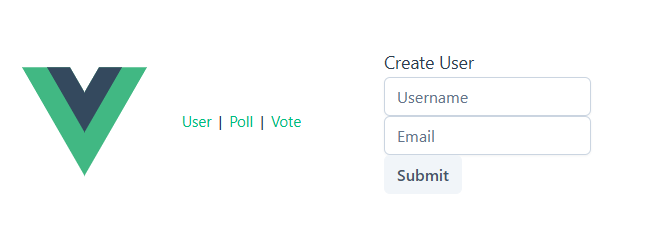
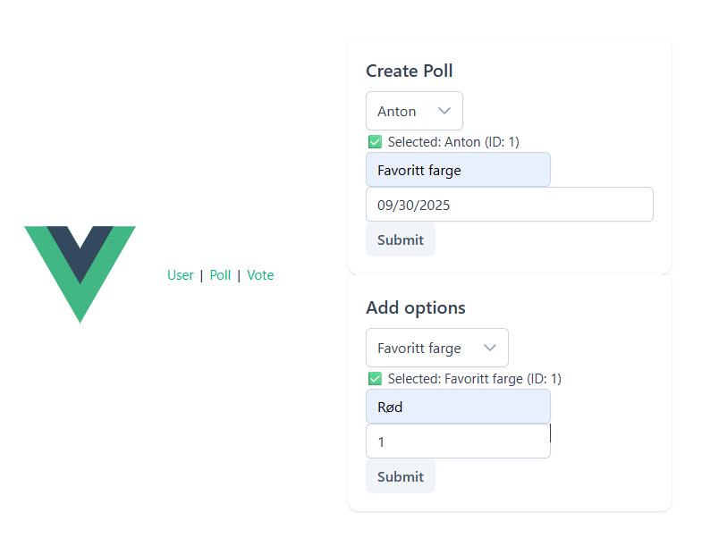
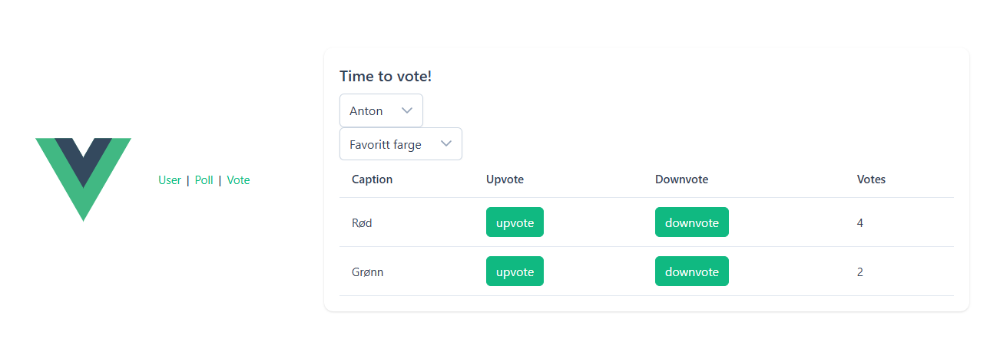

# Frontend project:
[Poll-app-vue](https://github.com/antimanio/poll-app-vue)

## Assignment
- I used the Vue Composition API for this project. I also used the PrimeVue library because I had some prior experience with it. P
- PrimeVue provided many built-in components, which helped speed up development.
### Through this project, I learned more about key Composition API concepts such as:
- `ref`: used to create reactive variables that automatically update the UI when their values change.
- `watch`: allows you to run a function in response to changes in a reactive variable or computed property.
- `onMounted`: a lifecycle hook that runs after the component is mounted, useful for fetching data or initializing things.
- In addition, I used `Axios` to handle HTTP requests to communicate with my backend API.
- I also used `Vue Router` to manage navigation between different pages of the app.
- Added some few validations.

## Future Work
- Presentation order is not handled. Just the last vote option added. 
- There is some repetitive code in my project that could probably benefit from refactoring, but overall I am happy with the results.

## Results

### Create User

### Create Poll & Options

### Vote

