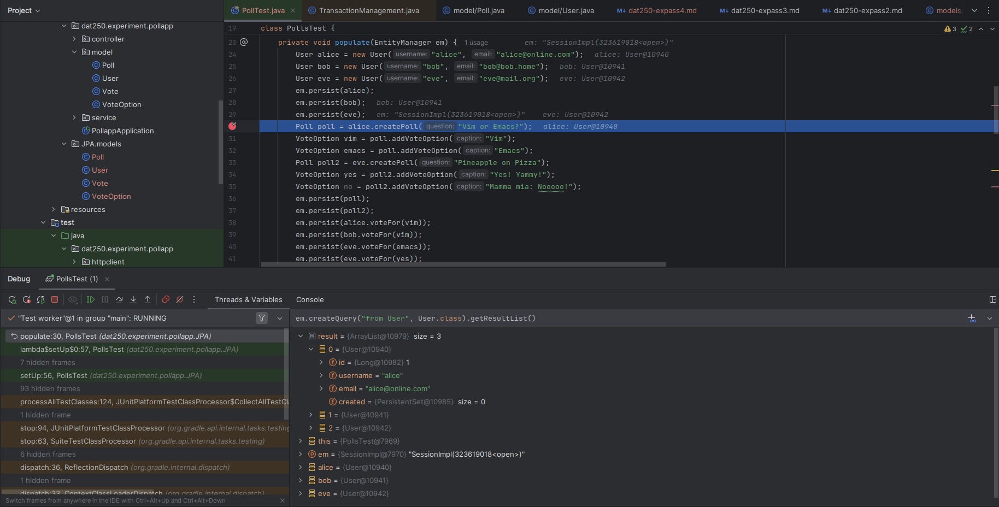
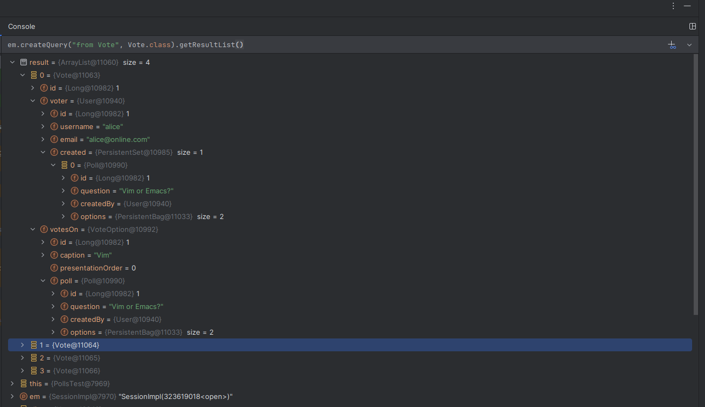
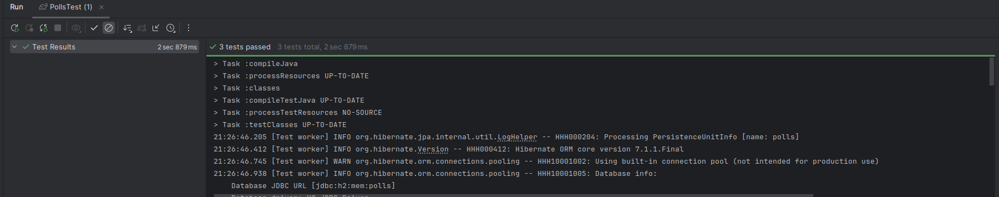

# JPA, Hibarnate & H2 Database
- Hibernate is a Java framework that acts as an ORM (Object–Relational Mapping) tool, meaning it maps your Java objects (like User, Poll) to database tables (like users, polls). 
- Instead of writing SQL queries manually for CRUD operations, you annotate your classes with JPA (Jakarta Persistence Architecture) annotations, and Hibernate automatically generates the SQL behind the scenes. 
- It also manages connections, caching, and even database schema creation if configured.

- H2 Database is a lightweight, fast, in-memory database. 
- It’s used for testing because it creates a fresh database in memory when the program starts and clears everything when the program ends. 
- Since it supports standard SQL, Hibernate can work with it easily. For example, in a test you might see:
- `.property(PersistenceConfiguration.JDBC_URL, "jdbc:h2:mem:polls")`, which means hibernate is using H2 Database named polls. 

## PollTest.java - setUp()
- EntityManger is the main object used to interact with the database (CRUD-operations). EntityMangerFactory produces EntityManager objects.
- The EntityManagerFactory is the setup and entry point for working with the H2 database.
- The configuration in  says “Use an in-memory H2 database called polls, wipe and recreate it each run, and manage the entities Poll, User, Vote, and VoteOption.”

# JPA Annotations
- `@Entity`, marks class as JPA entity (a persistent object). Hibernate will map this class to a table in the database. 
- `@Table`, Specifies the table name in the database.
- `@Id`, Primary key. `@GeneratedValue(strategy = GenerationType.IDENTITY)`, auto-increment. 

## OneToMany & ManyToOne
   
### User class
```
@OneToMany(mappedBy = "createdBy", cascade = CascadeType.ALL, orphanRemoval = true)`
private Set<Poll> created;
```

Explanation:
- One user can create many polls. 
- mappedBy "createdBy" in the poll class.
- `cascade = CascadeType.ALL` means: if you save/delete a User, its polls will be saved/deleted too.

| Operation | 	Effect                                                                   |
|-----------|---------------------------------------------------------------------------|
| PERSIST   | Saving a User will also save all its Polls.                               |
| MERGE     | Updating a User will also update its Polls.                               |
| REMOVE    | Deleting a User will also delete its Polls.                               |
| REFRESH   | Refreshing a User from DB will also refresh its Polls.                    | 
| DETACH    | Detaching a User from the persistence context will also detach its Polls. |

- `orphanRemoval = true`. If you remove a Poll from the created set, Hibernate will delete it from the database, even if the User itself is not deleted.

### Poll class
```
@ManyToOne
@JoinColumn(name = "created_by_id")
private User createdBy;
```

Explanation:
- Many Polls can be created by one User. 
- It contains the foreign key column "created_by_id". 

# Report
- The assignment went smoothly; it was mostly theoretical, focused on understanding the annotations and how everything works behind the scenes.
- I used the Evaluation expression to inspect data in DB while debugging the test:
- List of users


- You can see the user/voter Alice made the poll Vim or Emacs. She voted on Vim. 


Test passed:
- 