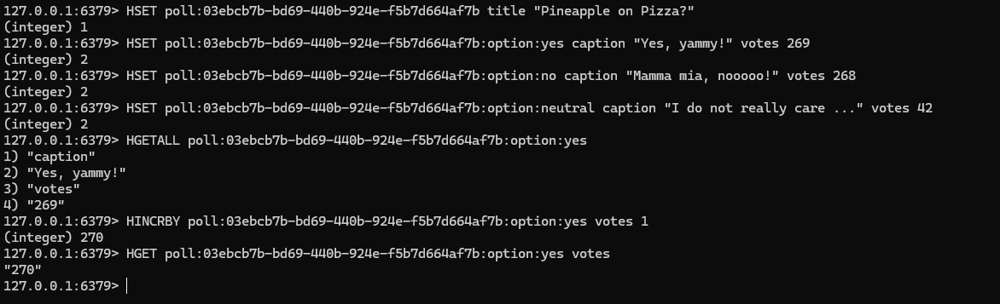
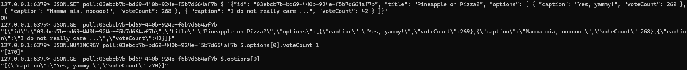

# Redis

## Use case 1:
Operations on Set datatype:
- SADD: Add one or more members to a set	
- SREM:	Remove one or more members from a set	
- SMEMBERS: List all members of the set	
- SISMEMBER: Check if a specific member is in the set
- SCARD: Count how many members are in the set

1. Initial state: no user is logged in
   - `SMEMBERS logged_in_users` -> (empty array)
2. User "alice" logs in
   - `SADD logged_in_users alice` -> 1
3. User "bob" logs in
   - `SADD logged_in_users bob` -> 1
4. Check users
   - `SMEMBERS logged_in_users` -> 1) "alice", 2) "bob"
5. User "alice" logs off 
   - `SREM logged_in_users alice` -> 1
   - `SISMEMBER logged_in_users alice` -> 0
6. User "eve" logs in
   - `SADD logged_in_users eve` -> 1
7. Check users
   - `SMEMBERS logged_in_users` -> 1) "bob", 2) "eve"
8. Clear the set
   - `DEL logged_in_users` -> 1

## Use Case 2:

### Using Hash:
###### Create title: 
- `HSET poll:03ebcb7b-bd69-440b-924e-f5b7d664af7b title "Pineapple on Pizza?"`

###### Create hash per poll option:
- `HSET poll:03ebcb7b-bd69-440b-924e-f5b7d664af7b:option:yes caption "Yes, yammy!" votes 269`
- `HSET poll:03ebcb7b-bd69-440b-924e-f5b7d664af7b:option:no caption "Mamma mia, nooooo!" votes 268`
- `HSET poll:03ebcb7b-bd69-440b-924e-f5b7d664af7b:option:neutral caption "I do not really care ..." votes 42`

###### Get all fields for option yes: 
- `HGETALL poll:03ebcb7b-bd69-440b-924e-f5b7d664af7b:option:yes`

###### Increment vote count:
-`HINCRBY poll:03ebcb7b-bd69-440b-924e-f5b7d664af7b:option:yes votes 1`
- Redis Has support atomic increment with `HINCRBY` without rewriting the whole object. 

###### Check result: 
- `HGET poll:03ebcb7b-bd69-440b-924e-f5b7d664af7b:option:yes votes`

###### Flow:

### Using ReJSON
###### Store Json Values:
- `JSON.SET poll:03ebcb7b-bd69-440b-924e-f5b7d664af7b $ '{"id": "03ebcb7b-bd69-440b-924e-f5b7d664af7b", "title": "Pineapple on Pizza?", "options": [ { "caption": "Yes, yammy!", "voteCount": 269 }, { "caption": "Mamma mia, nooooo!", "voteCount": 268 }, { "caption": "I do not really care ...", "voteCount": 42 } ]}'`
###### Retrieve Json Values:
- `JSON.GET poll:03ebcb7b-bd69-440b-924e-f5b7d664af7b`
###### Increment vote count for the first option: 
- `JSON.NUMINCRBY poll:03ebcb7b-bd69-440b-924e-f5b7d664af7b $.options[0].voteCount 1`
###### Delete key: 
- `DEL poll:03ebcb7b-bd69-440b-924e-f5b7d664af7b`
###### Flow:
- 