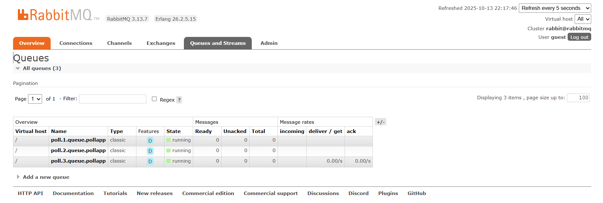
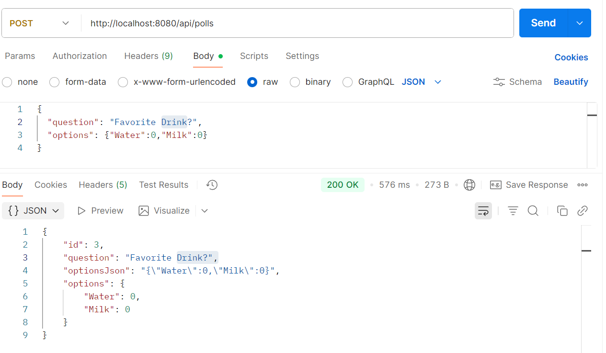
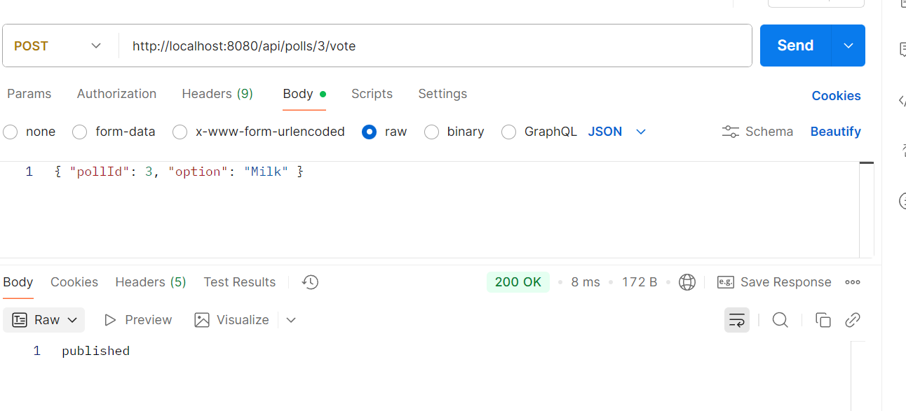
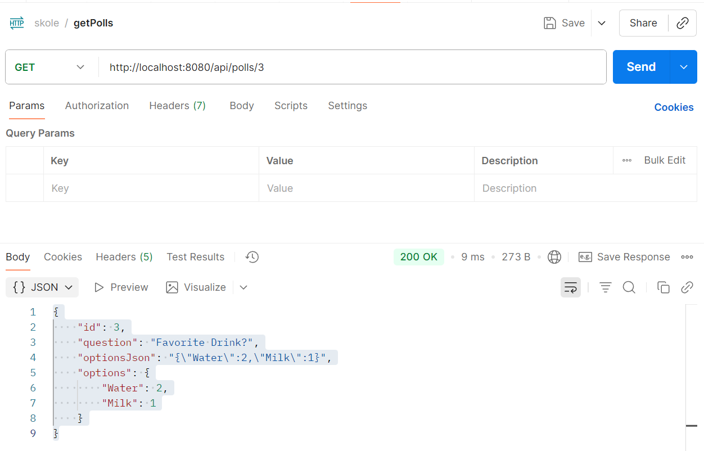
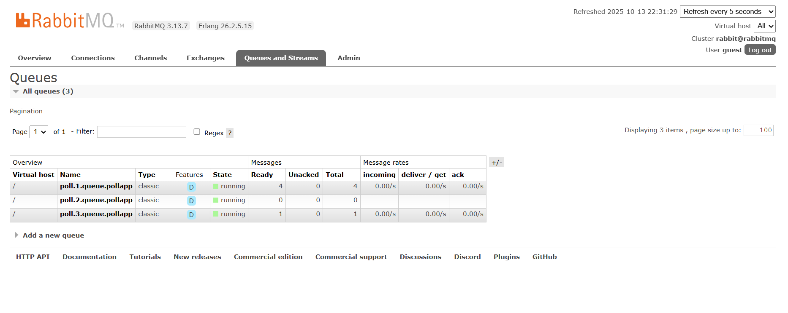

# Set up rabbitMQ using docker (rabbitMQ-folder)

## Pull image from dockerhub and run container
- `docker run -d \
--hostname rabbitmq \
--name rabbitmq \
-p 5672:5672 \
-p 15672:15672 \
rabbitmq:3-management`

- 5672 is the AMQP port (app connects here).
- 15672 is the management UI.
- rabbitmq:3-management is the tag.

## Login:
- Username: guest
- Password: guest
 
## Assignment

### `pollService#CreatePoll`:
- A FanoutExchange is created for the poll. FanoutE
- A queue is created for the application to consume votes. 
- The queue is bound to exchange, ensure any vote messages sent to the topic reach to the application. 
- This setup ensures every poll automatically gets its own topic in RabbitMQ.
- Queue: 
- 

- Fanout exchange and  SimpleMessageListenerContainer immediately consumes any messages from the queue.
- This happens so fast that by the time you look at RabbitMQ UI, there are no messages left in the queue.
- There Ready, Unacked and Total is 0. 

### Event flow

#### 1. Poll creation
- User creates poll with question and options
- Save Poll Entity in H2 database
- A topic/exchange and queue are created in RabbitMQ
- Listener is attached to the queue to consume vote messages. 
- 

#### 2. Voting
- User sends vote option
- Application publishes a JSON message to the corresponding exchange. 
- A FanoutExchange ensure the messages reaches all bound queues. 
- 

#### 3. Vote consumption
- `SimpleMessageListenerContainer` listens to the queue.
- `VoteHandler#handleVote` is triggered with the message body.
- Increments the option count, save back to H2 database. 

#### Step 4: Result Update
- Fetch result
- 

#### How to see messages “stuck” in the queue for testing: 
- Stop the listener container temporarily before sending votes. This will accumulate messages:
- In `pollService#CreatePoll`  --> `listenerContainer.stop();`
- 

## Reflection
- I had some problem with application.properties. Spring not detecting the attributes.
- I think, I needed to download the IntelliJ Idea Ultimate Edition. Anyway, I just manually configured the properties in the `RabbitMQApplication`. 
- Everything else worked fine: polls create exchanges/queues, votes are published and consumed, and the H2 database updates correctly. No major problems remain.

